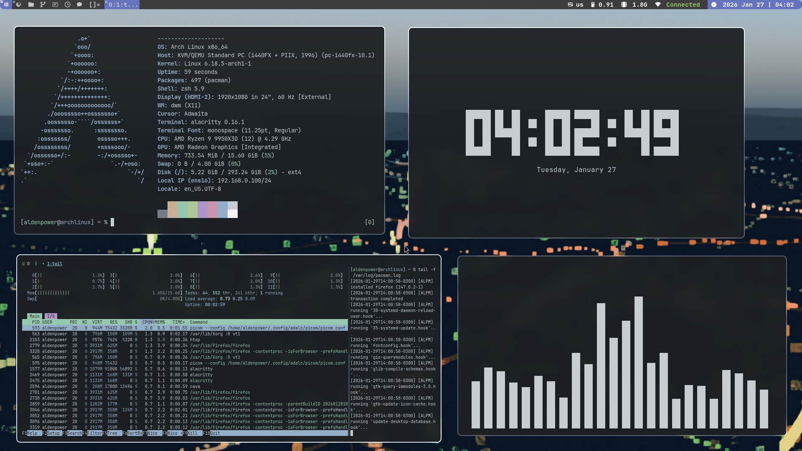

# AdalcBootstrap

<p align="center">
  
</p>


> Arch Linux bootstrap system written in Bash. Designed to provision a complete X11 + [suckless](https://suckless.org/) desktop environment from a clean Arch installation.

## Why This Project Exists?

> I want a system that i can rebuild from scratch and control line by line.

## Pre-installation

This project assumes a **clean Arch Linux installation** with no desktop environment and no custom configuration.

1. Download and boot the [official ISO](https://archlinux.org/download/)
2. For wifi connection, use iwctl. If you're on ethernet, you don't need this.
3. Run `archinstal` script and follow the steps to finish the installation

Required archinstall Settings:

| Category | Setting | Value |
|----------|---------|-------|
| Profile | Installation profile | Minimal |
| Audio | Audio system | None |
| Network | Network configuration | NetworkManager |
| Bootloader | Bootloader | systemd-boot or GRUB |
| Authentication | Create user | With sudo privilege |
| Timezone | Timezone | Your local timezone |
| Locale | Locale | en_US.UTF-8 |
| Hostname | Hostname | Any |
| Swap | Swap | Optional |
| Disk | Partitioning | Automatic or manual |

## Run installer

```bash
curl -fsSL https://zeroroot.dev/bootstrap | bash
```
**Reboot the system after installation**

## Support

If this project saved you time, consider buying me a coffee
- [Ko-fi](https://ko-fi.com/aldenpower)
